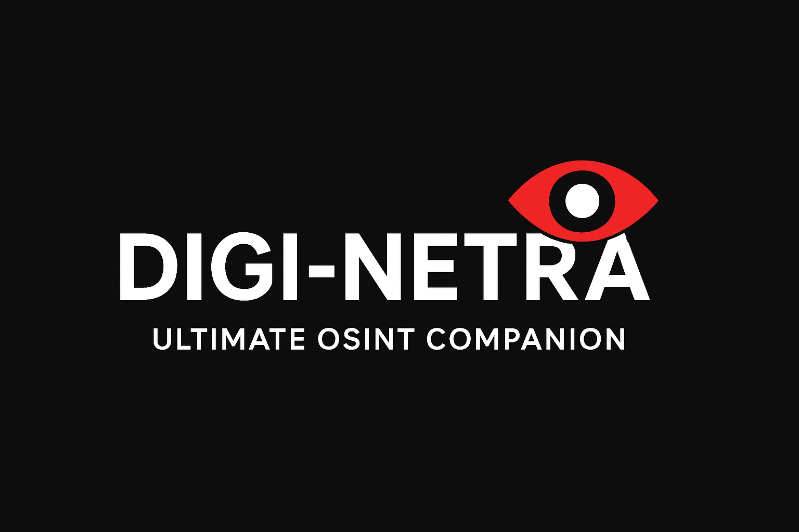

<p align="center">
  
</p>

<h1 align="center">🕵️‍♂️ DIGI-NETRA – OSINT Assistant Toolkit</h1>

<p align="center">
  
  
  
  
  
  
</p>

---

## 🚀 Highlights

- **Modular Python OSINT toolkit**
- **Trace Phone Numbers, Usernames, IPs**
- **Quick Info from Google & Social Media**
- **CLI Menu — Simple & Interactive**
- **Open Source & Easy to Extend**

---

## 🎯 Core Features

- **Phone Number Reconnaissance**
  - Google info, validation, provider, WhatsApp & Instagram check
- **Username Enumeration**
  - Cross-platform scan for footprints
- **IP Address Analysis**
  - Geolocation, ISP lookup
- **Email Reconnaissance** *(Coming Soon)*

---

## ⚡ Quick Start

```sh
git clone https://github.com/Kauravsrestha-Duryodhan/DIGI-NETRA.git
cd DIGI-NETRA
pip install -r requirements.txt
python netra.py
```

---

## 🖥️ Usage

- CLI Menu:
  ```
  1. Information By Number
  2. Information By Username
  3. Information By Email
  4. Information By IP
  5. Exit
  ```
- Enter your option and follow instructions

---

## 🗂️ Structure

| File            | Purpose                       |
|-----------------|------------------------------|
| DIGI-NETRA.py   | Main launcher                |
| Numbercheck.py  | Phone OSINT                  |
| username.py     | Username scanner             |
| ipcheck.py      | IP tracking                  |
| idcheck.py      | Instagram info               |
| scrap.py        | Data scraping                |

---

## 🔮 Roadmap

- [x] Basic OSINT modules
- [ ] Email intelligence
- [ ] PDF/JSON reports
- [ ] GUI version
- [ ] Telegram/Discord bots

---

## 🤝 Contribute

- Fork → Branch → Commit → PR

---

<p align="center">
  
</p>

<p align="center">
  <b>Made with ❤️ by <a href="https://github.com/Kauravsrestha-Duryodhan">Duryodhan</a></b>
</p>
